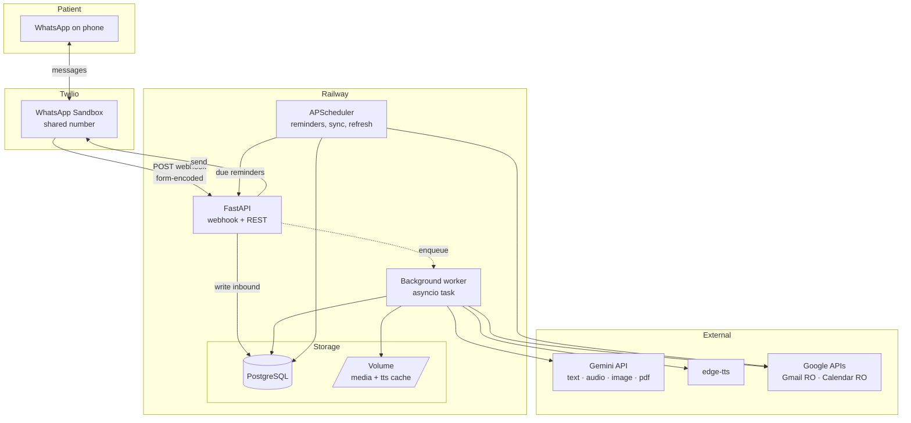

# 01 — Executive Summary & System Architecture

Covers brief sections 1 and 2.

## 1.1 Project goal

A dementia patient interacts with one thing: a WhatsApp chat. Behind it, an assistant answers
orientation questions ("what am I doing today?", "who is visiting?"), reads their Gmail and
Google Calendar on their behalf, delivers medication and appointment reminders, and can raise
an SOS. It works identically in English and Simplified Chinese, in text or voice, and switches
between them without being told to.

The demo audience is a hackathon judge role-playing the patient. The design target is
therefore: **zero setup for the person using it, and nothing on screen but WhatsApp.**

## 1.2 Architecture in one paragraph

A single FastAPI service on Railway receives Twilio webhooks, writes every inbound message to
Postgres immediately, and returns `200` in under half a second. An in-process background worker
picks the message up, routes it by type through one of six pipelines, and in almost every case
makes exactly one call to Gemini — which handles transcription, OCR, vision, document reading,
and generation in a single multimodal model. The reply goes back through an outbound gateway
that knows whether the 24-hour WhatsApp window is open. A scheduler fires reminders on the same
gateway. Google tokens sit encrypted in Postgres; Gmail and Calendar are read-only.

## 1.3 Key design decisions

| Decision | Rationale | What it costs you |
|---|---|---|
| **One multimodal model instead of five specialist services** | Gemini does STT, OCR, vision, and PDF reading natively. Collapsing them removes Whisper, Tesseract/PaddleOCR, a vision model, and a PDF parser — four dependency trees, four failure modes, four sets of Chinese-language edge cases. It is also better at Mandarin OCR and at code-switched speech than the OSS alternatives. | Single point of failure. Mitigated by a degraded-mode path per pipeline (§05). |
| **Monolith, not microservices** | One service, one deploy, one log stream. At demo scale, splitting costs you a day and buys nothing. | Named in §14 as the first thing to split if this ever grows. |
| **In-process APScheduler, not Celery** | No Redis, no broker, no second container, no `$` on Railway. Postgres is the queue. | Single-instance only. Documented and accepted. |
| **Write-then-process, never process-in-webhook** | Twilio's webhook times out; Gemini takes 2–8s on media. Also means a crash mid-pipeline never loses the user's message. | Needs an outbox and a worker loop. Worth it. |
| **Deterministic path for anything medical or emergency** | See `CLAUDE.md` SAFETY-1 and SAFETY-2. The LLM phrases; it does not decide. | Slightly stiffer wording on medication replies. Correct trade. |
| **Language detected per message, not per user** | Real bilingual Singaporean speech code-switches mid-sentence. A per-user language setting produces the wrong reply about a third of the time. | One extra field on every message row. |
| **Location is pull-based** | WhatsApp does not stream GPS to webhooks. Honest design beats a demo that can't be explained. | Loses passive wandering detection. Called out in §14 as the top future item. |

## 2.1 High-level architecture



## 2.2 Components

| Component | Responsibility | Module |
|---|---|---|
| Webhook receiver | Validate Twilio signature, parse form payload, persist raw message, enqueue, return 200 | `app/api/webhooks.py` |
| Inbound normalizer | Turn six wire formats (text/audio/image/document/location/vcard) into one internal `InboundMessage` | `app/channels/inbound.py` |
| Media fetcher | Download from Twilio's authenticated media URL to the volume, hash, size-check, sniff MIME | `app/channels/media.py` |
| Router | Pick a pipeline from message type + intent | `app/pipelines/router.py` |
| Pipelines | Six of them; see §05 | `app/pipelines/` |
| Gemini client | Single choke point for all AI. Retries, 429 backoff, timeouts, usage accounting | `app/ai/gemini_client.py` |
| Safety guards | Medication guard, SOS handler, simple-language post-processor | `app/safety/` |
| Outbound gateway | Window check, template fallback, throttle, media/text split, transcode | `app/channels/outbound.py` |
| Scheduler | Reminder fire, calendar sync, Gmail poll, token refresh, cleanup | `app/jobs/` |
| Google service layer | OAuth dance, encrypted token store, Gmail + Calendar read clients | `app/google/` |

## 2.3 Request lifecycle — inbound text

```
1.  Patient sends "我今天要做什么?" to the sandbox number
2.  Twilio POSTs application/x-www-form-urlencoded to /webhooks/twilio
3.  validate_twilio_signature(X-Twilio-Signature, url, params)   → reject 403 if bad
4.  upsert user by WaId; open or reuse conversation
5.  INSERT messages row (direction=inbound, status=received, raw payload)
6.  UPDATE users.last_inbound_at = now()      ← this is what opens the 24h window
7.  enqueue(message_id) onto the in-process queue
8.  return 200 + empty <Response/>            ← target < 500ms, hard stop
    ────────────── webhook ends, worker begins ──────────────
9.  worker dequeues, loads message + user
10. detect language → zh-Hans
11. router → text pipeline
12. assemble context: profile, today's meds, today's events, recent turns, unread email digest
13. gemini_client.generate(system=dementia_persona_zh, context=..., user_text=...)
14. medication_guard.check(response, allowed_meds)   → pass or replace
15. simplifier.enforce(response)                     → sentence length, reading level
16. INSERT messages row (direction=outbound, status=queued)
17. outbound.send(user, text)  → window open? free-form. closed? template fallback.
18. if user's reply_mode includes audio: tts → mp3 → ffmpeg ogg/opus → second send
19. UPDATE status=sent, store Twilio SID; delivery callbacks update to delivered/read
```

Steps 3–8 are the only synchronous path. Everything after step 8 can fail, retry, or degrade
without the user's message being lost.

## 2.4 Data flow

**Inbound media** — Twilio stores the file and gives you a URL requiring HTTP Basic auth with
your Account SID and Auth Token. Fetch it once, write to the Railway volume under
`/data/media/{user_id}/{sha256}.{ext}`, record `media_files`, then hand the local path to the
pipeline. Never pass Twilio's URL to Gemini; it is authenticated and will 401.

**Outbound media** — Twilio fetches your `MediaUrl` itself, so generated audio must be served
from a publicly reachable URL on your own service: `GET /media/{token}`. Use a short-lived
signed token, not a guessable path. Twilio issues a `HEAD` first to validate `Content-Type`,
so set it correctly (`audio/ogg`) or the send is rejected.

**Cached Google data** — Gmail and Calendar are polled on a schedule into `email_cache` and
`calendar_events`, not queried live per message. Three reasons: the patient asks the same
question repeatedly (that is the nature of the condition), the answer must be instant, and it
keeps you well inside Google's quotas. Freshness target is 15 minutes; a manual "check my email
now" forces a sync.

## 2.5 Deployment shape

One Railway project, three services:

| Service | Type | Notes |
|---|---|---|
| `api` | Docker web service | FastAPI + worker + scheduler in one container, single replica |
| `postgres` | Railway managed Postgres | Provisioned from the Railway plugin |
| `volume` | Attached volume on `api` | 1 GB at `/data` for media and TTS cache |

Single replica is a hard requirement while the scheduler runs in-process — two replicas would
fire every reminder twice. If you ever scale out, the scheduler moves first. See §14.
