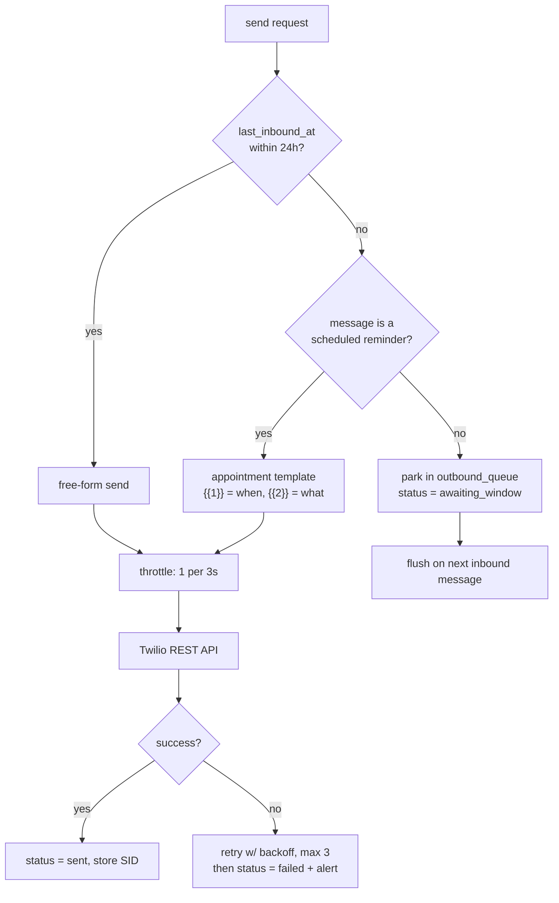

# 03 — WhatsApp Channel (Twilio, Meta Business Account)

Covers brief section 5. This is the highest-risk document in the set. Read it fully before
writing any channel code.

## 3.1 The flow

```
Patient (WhatsApp)
   ↓  message to +1 315 812 6378 (own number, Meta Business Account)
Twilio WhatsApp
   ↓  HTTP POST, application/x-www-form-urlencoded, X-Twilio-Signature header
Railway  →  POST /webhooks/twilio
   ↓  validate signature · persist · enqueue · return 200 <Response/>   (< 500ms)
Background worker
   ↓  normalize → fetch media → route → pipeline
Gemini  (transcribe / OCR / see / read / generate)
   ↓
Outbound gateway  (window check → throttle → send)
   ↓
Twilio  →  Patient
```

## 3.2 One-time setup

+1 315 812 6378 is bought through Twilio and connected to a Meta Business Account — no sandbox,
no join code, no `join <two-words>` step for anyone to remember or lapse. What's still true and
still needs doing per environment:

1. Twilio Console → the number's config → **When a message comes in** →
   `https://<app>.up.railway.app/webhooks/twilio`, method POST.
2. Set the **status callback** → `https://<app>.up.railway.app/webhooks/twilio/status`.
3. Custom message templates are submitted through Twilio's Content API and reviewed by Meta —
   see §3.4 — rather than being limited to three fixed ones.

The one thing that replaces "the join lapses": **the 24-hour customer-service window is Meta's
rule, not the sandbox's**, and it still applies (§3.4). A recipient who has never messaged this
number cannot receive a free-form send — that's now the thing to plan the demo around, not a
join code.

## 3.3 Inbound: the wire format

Twilio POSTs form-encoded key–value pairs. Not JSON. In FastAPI:

```
form = await request.form()      # NOT await request.json()
```

Fields you will actually use:

| Field | Present when | Notes |
|---|---|---|
| `MessageSid` | always | Idempotency key. Unique-constrain it; Twilio retries on non-2xx. |
| `AccountSid` | always | Verify it matches yours. |
| `From` | always | `whatsapp:+6591234567` — strip the `whatsapp:` prefix before storing. |
| `To` | always | This Twilio number. |
| `Body` | text messages | Empty string on pure-media messages. |
| `NumMedia` | always | String `"0"`, not an int. Cast it. |
| `MediaUrl0..N` | `NumMedia > 0` | **Requires HTTP Basic auth** (AccountSid : AuthToken) to fetch. |
| `MediaContentType0..N` | `NumMedia > 0` | Trust but verify — sniff the actual bytes too. |
| `ProfileName` | usually | WhatsApp display name. Good default for `users.display_name`. |
| `WaId` | always | The WhatsApp ID, digits only. Use this as the stable user key, not `From`. |
| `Latitude`, `Longitude` | location messages | Decimal degrees, as strings. |
| `Address`, `Label` | location, sometimes | Human-readable place; only present if the sender's client supplied it. |

### Signature validation

Every request carries `X-Twilio-Signature`: an HMAC-SHA1 over the full request URL plus the
sorted POST parameters, keyed with your Auth Token. Use `twilio.request_validator.RequestValidator`.
Reject with `403` on mismatch. Two gotchas:

- Railway terminates TLS at the edge, so `request.url` may report `http`. Build the URL from
  `X-Forwarded-Proto` or hardcode the public base URL from config. Getting this wrong makes
  every signature fail.
- Validate **before** parsing anything into your models.

### Handling the six input types

| Type | Detection | Handling |
|---|---|---|
| **Text** | `NumMedia == 0` and `Body` non-empty | Straight to the text pipeline. |
| **Voice note** | `MediaContentType0` starts `audio/` (usually `audio/ogg`) | Download → ffmpeg normalise → Gemini audio pipeline (§06). |
| **Image** | `image/jpeg`, `image/png` | Download → Gemini vision/OCR pipeline. Route by intent: pill bottle vs prescription vs scene. |
| **Document** | `application/pdf` | Download → Gemini document pipeline. Reject >16 MB and >30 pages with a friendly message. |
| **Location** | `Latitude` + `Longitude` present | Write `location_pings` → evaluate safe zones and shop triggers (§07). No AI call. |
| **Contact card** | `MediaContentType0` is `text/vcard` | Download, parse with `vobject`, write to `contacts`, ask "should I add them as an emergency contact?" |

All six normalise into one internal shape before the router sees them:

```
InboundMessage:
  user_id, message_sid, kind: text|audio|image|document|location|contact
  text: str | None
  media: MediaRef | None        # local path, mime, sha256, bytes
  coords: (lat, lon) | None
  received_at: datetime
```

### Webhook response

Return `200` with `Content-Type: text/xml` and an empty `<Response/>`. Do not use TwiML to
reply — TwiML replies must be composed synchronously, which forces you to wait on Gemini
inside the webhook. All replies go out through the REST API from the worker instead.

Non-2xx makes Twilio retry, which duplicates messages. Catch everything, log it, still return
200. The only legitimate non-2xx is `403` on a bad signature.

## 3.4 Outbound: the 24-hour window

This is the constraint that shapes the reminder system.

- A message **from** the patient opens a 24-hour customer service window.
- Inside the window: any free-form text or media, no template needed.
- Outside the window: **only a pre-approved template.**
- This is **Meta's rule for the WhatsApp Business Platform, not a sandbox restriction** — it
  applies exactly the same now that this is a real number connected to a Meta Business Account.
  What changed by leaving the sandbox is who can create the templates.

### Templates

On the sandbox you were limited to three of Twilio's own fixed demo templates (an "appointment
reminder" with generic `{{1}}`/`{{2}}` fields, a verification code, an order-shipped notice) and
could not submit your own. On this number, **custom templates are submitted through Twilio's
Content API, reviewed by Meta, and approved (or rejected) per Meta's Business Messaging Policy**
— category (Utility/Marketing/Authentication matters for cost and rate limits), wording, and
variable placement all get checked. Submit well ahead of the demo, not the morning of; approval
is not instant. Look up an approved template's ContentSid via `GET /internal/debug/templates`.

### The outbound gateway

`app/channels/outbound.py` is the only module allowed to call Twilio. Its decision:



The `awaiting_window` state matters: when the patient next messages, the gateway flushes
anything parked, oldest first, so nothing is silently dropped.

### The template for medication reminders

On the sandbox this section used to describe a workaround: Twilio's fixed "appointment" template
had only two generic fields, so a medication reminder had to be stuffed into wording meant for
something else (*"Your appointment is coming up on today at 9:00 AM at your morning medicine —
Donepezil, 1 tablet"*) — grammatically awkward, and worth mitigating by keeping the 24-hour
window open wherever possible so the free-form reply fired instead.

**That workaround is no longer necessary.** A real, properly-worded Utility template can be
submitted and approved directly — there is no fallback wording to apologise for. Draft and
submit these (§3.4 above covers the review process):

```
Name: medication_reminder    Category: UTILITY    Languages: en, zh_CN
en:     Hi {{1}}, it is time for your {{2}}. Please take {{3}}. Reply OK when done.
zh_CN:  {{1}}，该吃{{2}}了。请服用{{3}}。吃完请回复"好"。
```

**Check this against the code before relying on it.** `app/channels/outbound.py::send_reminder`
currently calls `provider.send_template(...)` with exactly two variables (`{"1": template_when,
"2": template_what}`), matching the old two-field appointment template. The draft above has
*three* — name, medicine, dose. Either adjust the template to two variables to match today's
code, or update `send_reminder`'s call to pass three; submitting a 3-variable template and
leaving the 2-variable call in place will send with a variable mismatched or missing. Keeping
the window open (send a gentle morning check-in, let the patient's reply open free-form replies
for the rest of the day) remains good practice regardless — it's just no longer covering for a
compromise.

### Media send rules

Non-negotiable, from Twilio's own documentation:

1. **A free-form media message cannot carry a caption.** If you pass `Body` alongside
   `MediaUrl`, the body is dropped and never delivered. Send text first, then media.
2. **One media object per message.** Extra `MediaUrl` params are ignored.
3. **Voice notes must be OGG with the Opus codec.** MP3 arrives as a downloadable file with
   no play button — useless for this user. Transcode:
   `ffmpeg -i in.mp3 -c:a libopus -b:a 24k -ar 48000 out.ogg`
4. **Size caps:** audio/video/document 16 MB, images 5 MB. Twilio will not transcode for you.
5. **Filenames ≤20 characters, ASCII letters/digits/`-`/`_`/`.` only.**
6. Twilio issues a `HEAD` to your `MediaUrl` and rejects the send if the `Content-Type` header
   doesn't match the actual file. Serve `audio/ogg` explicitly.
7. **Throttle: one message every three seconds.** Self-imposed in `app/channels/outbound.py`
   (`THROTTLE_SECONDS`), not a Twilio-enforced sandbox limit — unaffected by owning this number,
   and still worth keeping. A text-plus-voice reply is two messages, so budget 3s between them
   and never fire a burst of reminders.

### Status callbacks

`POST /webhooks/twilio/status` receives `MessageSid`, `MessageStatus`
(`queued|sent|delivered|read|failed|undelivered`), and `ErrorCode` on failure. Update the
`messages` row. Error codes worth handling explicitly:

| Code | Meaning | Action |
|---|---|---|
| 63016 | Free-form message outside the window | Re-route through the template path. Indicates a gateway bug. This is now the main outside-window failure to expect — the old 63007/"hasn't joined" case doesn't apply to this number, since there's no sandbox join step anymore. Not independently verified against this account's error codes; check the Twilio Console debugger the first time a send fails. |
| 63005 | Media rejected | Check MIME, size, filename length. |
| 21610 | Recipient opted out (`STOP`) | Stop all sends to this user. Honour it. |
| 63018 | Rate limit | Back off; your throttle is too aggressive. |

## 3.5 Provider abstraction

Define `ChannelProvider` with `send_text`, `send_media`, `send_template`, `parse_inbound`.
`TwilioWhatsAppProvider` is what's implemented and in use — still Twilio's API, now backed by
this Meta-connected number rather than the sandbox. The original motivation for a second
`MetaCloudProvider` implementation (escaping the custom-template restriction and the 3-day join
expiry) no longer applies: this number already has both. The interface stays worth keeping for
its own sake, but there's no functionality gap left for a second provider to close.

## 3.6 Local development

Twilio must reach a public URL. Use `ngrok http 8000` and point the webhook at the forwarding
address. Re-point it whenever ngrok restarts (the free tier gives you a new subdomain each time
— a paid static domain or a Cloudflare Tunnel avoids this).

Keep a `scripts/fake_twilio_post.py` that replays realistic form payloads with valid
signatures against localhost, so you can develop all six input types without a phone.
