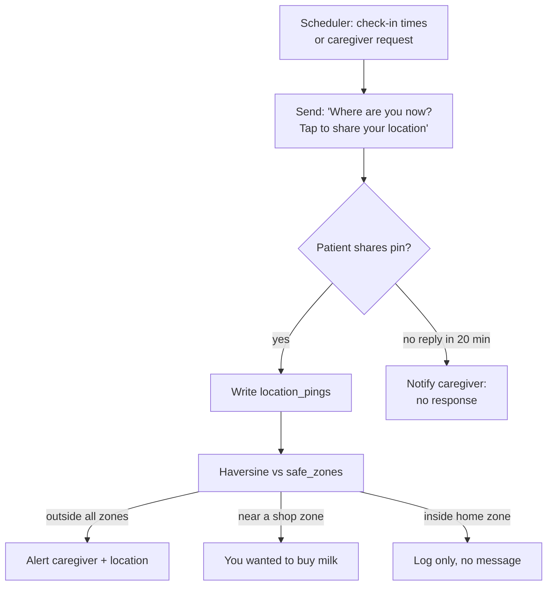

# 07 — Feature-by-Feature Implementation

Covers brief section 4, plus the dementia and location features.

Each feature: APIs · libraries · workflow · dependencies · database · error cases · security.

---

## 7.1 WhatsApp conversational assistant

- **APIs:** Twilio Messaging (send), Twilio webhook (receive), Gemini.
- **Libraries:** `twilio`, `fastapi`, `google-genai`.
- **Workflow:** §03 §3.1 and §05 §5.1.
- **Depends on:** nothing. Build this first — everything else plugs into it.
- **Database:** `users`, `conversations`, `messages`.
- **Errors:** bad signature → 403. Unknown sender → auto-create user, send onboarding.
  Gemini timeout → "give me a moment" then retry once. Twilio send failure → queue and retry.
- **Security:** signature validation on every request; per-sender rate limit (20 msg/min) to
  stop a loop from burning your Gemini quota.

## 7.2 Google OAuth login

- **APIs:** Google OAuth 2.0.
- **Libraries:** `google-auth-oauthlib`, `cryptography`.
- **Workflow:** §04 §4.1.
- **Depends on:** 7.1 (link delivered over WhatsApp).
- **Database:** `oauth_states`, `oauth_tokens`.
- **Errors:** state expired/reused → generic error page, ask them to restart. User denies
  consent → friendly WhatsApp message, no retry loop. `invalid_grant` → delete token, prompt
  reconnect.
- **Security:** single-use state, exact `redirect_uri` match, Fernet at rest, read-only scopes,
  tokens never logged.

## 7.3 Gmail integration & AI email summarisation

- **APIs:** Gmail `users.messages.list` / `.get`, Gemini.
- **Libraries:** `google-api-python-client` (wrap in `asyncio.to_thread`).
- **Workflow:** §04 §4.2.
- **Depends on:** 7.2.
- **Database:** `email_cache`.
- **Errors:** 401 → refresh once, then prompt reconnect. 429 → back off, skip this cycle.
  Gemini failure → store with rules-based category only, no summary.
- **Security:** read-only scope; store snippets and summaries, **not full message bodies**;
  never surface content to anyone but the owning user.

## 7.4 AI appointment summarisation

- **APIs:** Google Calendar `events.list`, Gemini.
- **Workflow:** §04 §4.3, §05 §5.6.
- **Depends on:** 7.2.
- **Database:** `calendar_events`, `reminders`.
- **Errors:** 410 on stale `syncToken` → full re-list. Empty calendar → "you have nothing
  scheduled" (a real answer, not an error).
- **Security:** read-only scope.

## 7.5 Natural language Q&A

- **Workflow:** §05 §5.1.
- **Database:** reads across `medications`, `calendar_events`, `email_cache`, `contacts`,
  `messages`.
- **Errors:** out-of-scope question → answer generally, don't refuse coldly. Unanswerable
  from context → "I don't know that one — shall I tell your caregiver?"
- **Security:** context is scoped to `user_id` in every query. A missing `WHERE user_id = ?`
  is a cross-patient data leak; make it a review checklist item.

## 7.6 Dementia-specific features

The register matters more than the retrieval. System prompt rules:

- One idea per sentence. Under 15 words.
- Present tense, active voice.
- Concrete time references: "in one hour", "after lunch" — not "at 14:00".
- Name people by relationship *and* name: "your daughter, Mei Ling".
- Never say "as I mentioned", "you already asked", "remember". Repetition is the condition,
  not a mistake. Answer the fifth identical question exactly as warmly as the first.
- No lists longer than three items.
- End orientation answers with a small reassurance.
- Never express uncertainty about facts that are in the database — hedging is confusing.
  Hedge only when you genuinely don't know, and then offer to ask the caregiver.

| Question | Source | Response shape |
|---|---|---|
| "Where am I going today?" | `calendar_events` today | "You are seeing Dr Tan at 10 o'clock this morning. Your daughter will take you." |
| "What medicine do I take?" | `medications` **only** | "You take one white tablet in the morning, after breakfast." Names the drug only if the row has it, verbatim. |
| "Who is visiting today?" | events + `contacts` | "Your daughter, Mei Ling, is coming at 6 o'clock this evening." |
| "Say that again" | last outbound `messages` row | Re-send verbatim, same language, plus audio if the original had it. |
| Routine reminders | `reminders` where `kind='routine'` | Fixed daily times: meals, walk, bedtime. |
| Shopping reminders | `reminders` where `kind='shopping'`, optionally location-triggered | "You wanted to buy milk." |

**Repeat handling** is the highest-value, lowest-effort feature here. `repeat_last` is a
regex intent, a single DB read, and no AI call — and it is the thing a judge who knows
dementia will look for.

## 7.7 Medication reminders

**The safety-critical feature. Read `CLAUDE.md` SAFETY-1 first.**

- **Workflow:**
  1. Caregiver-verified rows in `medications` (seeded for the demo).
  2. Scheduler computes `next_fire_at` from the schedule.
  3. At fire time, the message is **rendered from the row by a template**, not generated:
     `"It is time for your {time_of_day} medicine. Please take {dose_text}."`
  4. The LLM may translate or gently rephrase that string. It receives the row as read-only
     context and may not add to it.
  5. `medication_guard` verifies every drug name in the output appears verbatim in the source
     row. Mismatch → discard, send the fallback.
  6. Sent via the outbound gateway (window rules, §03).
  7. Patient replies "OK"/"好" → `reminder_acks` row. No ack within 30 minutes → optional
     caregiver notification.
- **Database:** `medications`, `medication_candidates`, `reminders`, `reminder_acks`,
  `outbound_queue`.
- **Errors:** window closed → template fallback. Send fails → retry ×3, then alert caregiver.
  **Never silently drop a medication reminder** — log it as a distinct, alertable event.
- **Security:** `verified_by_caregiver_id` must be non-null for a row to drive a reminder.
  Unverified rows are invisible to the reminder system.

## 7.8 Appointment reminders

Same machinery, `source='calendar'`. T-24h and T-2h. Include location and who is accompanying
if the event has attendees. Deduplicate on `(google_event_id, offset)` so re-syncing doesn't
double-fire.

## 7.9 Emergency SOS

**No LLM anywhere in this path** (`CLAUDE.md` SAFETY-2).

- **Trigger:** regex on a phrase list in both languages — `help`, `sos`, `emergency`,
  `救命`, `紧急`, `帮我`. Also fires on a location pin sent with no accompanying text after
  a prior distress message.
- **Workflow:**
  1. Regex match → `sos_events` row, immediately.
  2. Look up `contacts` where `is_emergency = true`, ordered by priority.
  3. Send a fixed-string alert to each over WhatsApp, including the last known location if it
     is under 60 minutes old.
  4. Reply to the patient with fixed, calm text: *"I have told your daughter. Stay where you
     are. Help is coming."*
  5. Log everything. Do not mark resolved automatically.
- **Depends on:** contacts seeded during setup. **If no emergency contact exists, the reply
  must say so** rather than falsely reassuring: *"I don't have anyone to call. Please call 995."*
  A false "help is coming" is worse than no feature.
- **Errors:** contact send fails → try the next contact, log the failure, never tell the
  patient it worked when it didn't.
- **Security:** rate limit to prevent a stuck loop spamming family, but **never block a second
  genuine SOS**. Cap at one alert per contact per 5 minutes, not per hour.
- **Scope note:** this cannot dial emergency services. Say that clearly in the pitch and in
  onboarding. Twilio Programmable Voice could add a real call — out of scope for the demo,
  listed in §14.

## 7.10 Location features

**What WhatsApp actually gives you:** a single latitude/longitude when the user chooses to
share a pin. Not a stream. There is no background GPS.

The safe-zone monitoring in your architecture deck is therefore **redesigned as pull-based**:

- **Libraries:** plain math. Haversine is six lines; skip `geopy`.
- **Database:** `location_pings`, `safe_zones`.
- **Demo note:** this demos identically to real geofencing — the judge taps "share location"
  and gets a contextual reply. Present it honestly as pull-based; the passive version needs a
  companion app, which is the top item in §14.
- **Errors:** stale pin (>1h) → don't use it for scene context or SOS without saying it's old.
  No pin ever received → safe-zone features stay dormant, no errors.
- **Security:** location is among the most sensitive data here. Never log coordinates. Retain
  `location_pings` 30 days. Share only with `is_emergency` contacts, only on an SOS or a
  zone breach.

## 7.11 Contact cards

vCard arrives as `text/vcard` media. Parse with `vobject`, upsert `contacts`, then ask:
"Should I call [name] if there's an emergency?" A yes sets `is_emergency`. This is the
lowest-friction way to populate emergency contacts and takes about twenty lines.
