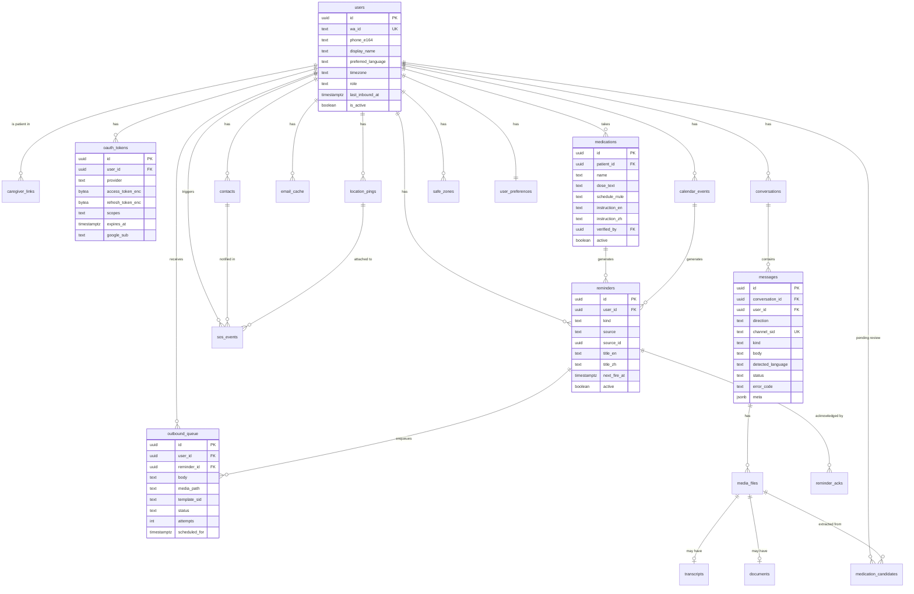

# 08 — PostgreSQL Database

Covers brief section 17.

Conventions: `id` is `UUID` default `gen_random_uuid()` (pgcrypto). All timestamps
`TIMESTAMPTZ` in UTC. `created_at`/`updated_at` on every table. Soft delete only where noted.

## 8.1 ER diagram

## 8.2 Tables

### `users`
Both patients and caregivers. One table, `role` discriminates.

| Column | Type | Constraints |
|---|---|---|
| `id` | uuid | PK |
| `wa_id` | text | **UNIQUE NOT NULL** — the stable WhatsApp ID from the webhook |
| `phone_e164` | text | NOT NULL |
| `display_name` | text | from `ProfileName` |
| `preferred_language` | text | NOT NULL DEFAULT `'en'`, CHECK IN (`'en'`,`'zh-Hans'`) |
| `timezone` | text | NOT NULL DEFAULT `'Asia/Singapore'` |
| `role` | text | NOT NULL DEFAULT `'patient'`, CHECK IN (`'patient'`,`'caregiver'`) |
| `last_inbound_at` | timestamptz | **drives the 24-hour window check** |
| `is_active` | boolean | NOT NULL DEFAULT true |

Index: `users_wa_id_key` (unique), `idx_users_last_inbound` on `last_inbound_at`.

### `caregiver_links`
Many-to-many. Stubbed for the demo (`CLAUDE.md`: no caregiver UI), but present so the schema
doesn't need surgery later.

`id` · `patient_id` FK→users · `caregiver_id` FK→users · `relationship` text ·
`is_emergency` bool · `priority` int.
UNIQUE `(patient_id, caregiver_id)`. CHECK `patient_id <> caregiver_id`.

### `oauth_tokens`

`id` · `user_id` FK→users ON DELETE CASCADE · `provider` text default `'google'` ·
`access_token_enc` **bytea** · `refresh_token_enc` **bytea** · `scopes` text ·
`expires_at` timestamptz NOT NULL · `google_sub` text · `last_refreshed_at` timestamptz.

UNIQUE `(user_id, provider)`. Index on `expires_at` — the refresh job scans it every 10 minutes.
**Never store these as `text`.** `bytea` makes accidental logging obvious in a dump.

### `oauth_states`
`id` · `state` text UNIQUE · `user_id` FK · `expires_at` · `used_at` nullable.
Index on `state`. Rows deleted by the cleanup job after 24h.

### `conversations`
`id` · `user_id` FK · `started_at` · `last_message_at` · `is_open` bool.
One open conversation per user; a new one after 7 days idle. Index `(user_id, is_open)`.

### `messages`

| Column | Type | Notes |
|---|---|---|
| `id` | uuid | PK |
| `conversation_id` | uuid | FK |
| `user_id` | uuid | FK |
| `direction` | text | CHECK IN (`'inbound'`,`'outbound'`) |
| `channel_sid` | text | **UNIQUE** — Twilio `MessageSid`. This is your idempotency guarantee. |
| `kind` | text | CHECK IN (`'text'`,`'audio'`,`'image'`,`'document'`,`'location'`,`'contact'`) |
| `body` | text | nullable |
| `detected_language` | text | CHECK IN (`'en'`,`'zh-Hans'`,`'mixed'`) |
| `status` | text | `received`\|`queued`\|`sent`\|`delivered`\|`read`\|`failed` |
| `error_code` | text | Twilio error code on failure |
| `meta` | jsonb | latency, model, tokens, pipeline — **never content** |

Indexes: unique on `channel_sid`; `(user_id, created_at DESC)` for history reads;
`(status)` partial where `status IN ('queued','failed')`.

### `media_files`
`id` · `message_id` FK · `kind` · `mime_type` · `size_bytes` · `storage_path` ·
`sha256` · `duration_ms` nullable · `page_count` nullable.
Index on `sha256` for dedupe. CHECK `size_bytes <= 16777216`.

### `transcripts`
`id` · `media_id` FK UNIQUE · `text` · `language` · `confidence` numeric(3,2) · `engine`.

### `documents`
`id` · `media_id` FK UNIQUE · `doc_kind` · `extracted_text` · `summary_en` · `summary_zh` ·
`was_scanned` bool.

### `medications`
**Source of truth for anything medical.**

| Column | Type | Notes |
|---|---|---|
| `patient_id` | uuid | FK |
| `name` | text | NOT NULL, verbatim as verified |
| `dose_text` | text | free text, e.g. "1 white tablet" |
| `schedule_rrule` | text | iCal RRULE, e.g. `FREQ=DAILY;BYHOUR=9;BYMINUTE=0` |
| `instruction_en` | text | pre-written simple language |
| `instruction_zh` | text | pre-written simple language |
| `verified_by` | uuid | FK→users. **NOT NULL for a row to drive a reminder.** |
| `verified_at` | timestamptz | |
| `active` | boolean | default true |

Partial index: `(patient_id) WHERE active AND verified_by IS NOT NULL`.

### `medication_candidates`
Where OCR and vision output goes. Never `medications`.
`id` · `patient_id` FK · `source_media_id` FK · `extracted` jsonb · `confidence` numeric ·
`status` CHECK IN (`'pending'`,`'approved'`,`'rejected'`) default `'pending'` ·
`reviewed_by` FK nullable · `reviewed_at`.

### `reminders`
`id` · `user_id` FK · `kind` CHECK IN (`'medication'`,`'appointment'`,`'routine'`,`'shopping'`) ·
`source` CHECK IN (`'manual'`,`'calendar'`,`'medication'`) · `source_id` uuid nullable ·
`title_en` · `title_zh` · `payload` jsonb · `rrule` text nullable ·
`next_fire_at` timestamptz · `last_fired_at` · `active` bool.

Index `(active, next_fire_at)` — the scheduler's hot path.
UNIQUE `(user_id, source, source_id, kind)` prevents duplicate reminders on re-sync.

### `reminder_acks`
`id` · `reminder_id` FK · `user_id` FK · `acked_at` · `via_message_id` FK.

### `outbound_queue`
`id` · `user_id` FK · `reminder_id` FK nullable · `body` text · `media_path` text nullable ·
`template_sid` text nullable · `status` CHECK IN
(`'pending'`,`'awaiting_window'`,`'sent'`,`'failed'`) · `attempts` int default 0 ·
`scheduled_for` timestamptz · `sent_at` · `last_error` text.

Index `(status, scheduled_for)`. This is the queue — claimed with
`SELECT ... FOR UPDATE SKIP LOCKED`, which is why there is no Redis.

### `calendar_events`
`id` · `user_id` FK · `google_event_id` text · `summary` · `description` · `location` ·
`start_at` · `end_at` · `is_all_day` bool · `attendees` jsonb · `content_hash` text ·
`synced_at`.
UNIQUE `(user_id, google_event_id)`. Index `(user_id, start_at)`.
`content_hash` is what lets you detect a rescheduled appointment.

### `email_cache`
`id` · `user_id` FK · `gmail_message_id` text · `thread_id` · `from_addr` · `from_name` ·
`subject` · `snippet` · `received_at` · `category` · `priority` smallint CHECK 1–5 ·
`needs_action` bool · `summary_en` · `summary_zh` · `is_read_to_user` bool.
UNIQUE `(user_id, gmail_message_id)`. Index `(user_id, priority DESC, received_at DESC)`.
**Store snippets and summaries, not full bodies.**

### `contacts`
`id` · `user_id` FK · `display_name` · `phone_e164` · `email` · `relationship` ·
`is_emergency` bool default false · `priority` int · `source` CHECK IN
(`'vcard'`,`'manual'`,`'google'`).
Index `(user_id, is_emergency, priority)`.

### `location_pings`
`id` · `user_id` FK · `lat` numeric(9,6) · `lon` numeric(9,6) · `accuracy_m` int nullable ·
`address` text nullable · `source` default `'whatsapp_pin'` · `created_at`.
Index `(user_id, created_at DESC)`. **30-day retention**, enforced by the cleanup job.

### `safe_zones`
`id` · `user_id` FK · `name` · `center_lat` · `center_lon` · `radius_m` int ·
`kind` CHECK IN (`'home'`,`'safe'`,`'shop'`) · `trigger_message_en` · `trigger_message_zh` ·
`active` bool.

### `sos_events`
`id` · `user_id` FK · `triggered_at` · `trigger_text` · `location_ping_id` FK nullable ·
`notified` jsonb (contact ids + send outcomes) · `resolved_at` nullable · `resolved_by` nullable.
Never auto-resolve.

### `user_preferences`
`id` · `user_id` FK **UNIQUE** · `reply_mode` CHECK IN (`'text'`,`'audio'`,`'both'`)
default `'both'` · `voice_en` default `'en-SG-LunaNeural'` · `voice_zh` default
`'zh-CN-XiaoxiaoNeural'` · `speech_rate` text default `'-15%'` ·
`quiet_hours_start` time · `quiet_hours_end` time · `daily_agenda_time` time default `'08:00'`.

### `audit_logs`
`id` · `actor_type` (`'user'`,`'system'`,`'caregiver'`) · `actor_id` · `action` · `entity` ·
`entity_id` · `meta` jsonb · `created_at`.
Index `(entity, entity_id)`, `(created_at DESC)`.
Written for: token issue/refresh/revoke, medication create/verify, SOS, caregiver notification,
data deletion. **Not** for ordinary messages — that's what `messages` is for.

### `ai_usage`
`id` · `user_id` nullable · `pipeline` · `model` · `input_tokens` · `output_tokens` ·
`latency_ms` · `outcome` · `created_at`.
Lets you see what is burning the free-tier quota. Two lines to write, saves an evening of guessing.

## 8.3 Cross-cutting constraints

- **Every user-scoped query filters on `user_id`.** No exceptions. This is the only thing
  standing between two patients' data.
- `ON DELETE CASCADE` from `users` through everything — a deletion request must actually delete.
- Foreign keys everywhere. At this scale the write cost is irrelevant and the class of bug
  they prevent is not.
- CHECK constraints on every enum-like column. Postgres enums are worse — altering one
  requires a migration dance.
- Partial indexes over filtered indexes where the query is always filtered
  (`WHERE active`, `WHERE status IN (...)`).

## 8.4 Retention

| Data | Retention | Enforced by |
|---|---|---|
| `location_pings` | 30 days | nightly cleanup job |
| `media_files` + volume blobs | 7 days after processing | nightly cleanup |
| `email_cache` | 30 days rolling | nightly cleanup |
| `messages` | kept (demo scale) | — |
| `audit_logs` | kept | — |
| `oauth_states` | 24 hours | nightly cleanup |

## 8.5 Migrations

Alembic, one migration per milestone, never edited after being applied to Railway. Seed data
lives in `scripts/seed_demo.py`, not in a migration — you will re-run it many times and want
it idempotent and separate from schema history.
