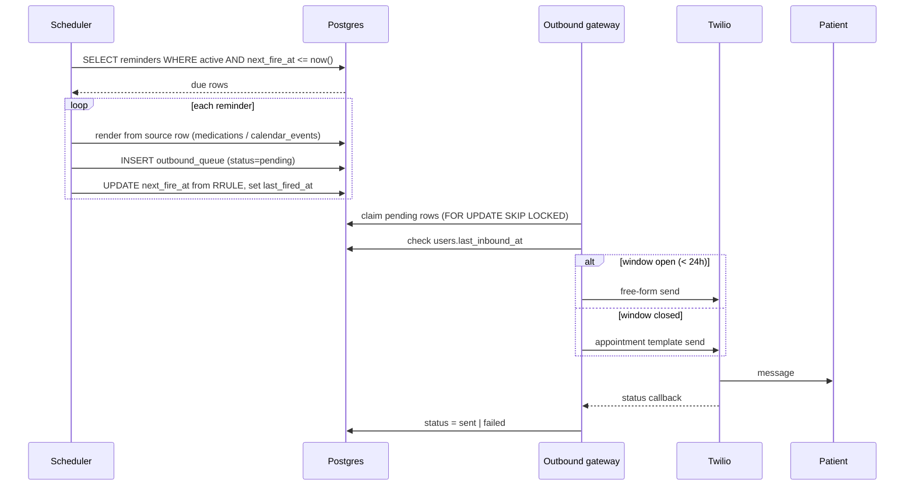

# 09 — API Endpoints & Background Jobs

Covers brief sections 19 and 20.

## 9.1 Endpoints

Most of the system has no public API — the interface is WhatsApp. The internal endpoints exist
for the webhook, OAuth, media serving, and operations. Anything marked **internal** requires
`X-Admin-Token` and is not exposed in the OpenAPI schema.

### Channel

| Method | Path | Auth | Purpose |
|---|---|---|---|
| `POST` | `/webhooks/twilio` | Twilio signature | Inbound messages. Returns `200` + empty TwiML in <500ms. |
| `POST` | `/webhooks/twilio/status` | Twilio signature | Delivery status callbacks. |
| `GET` | `/media/{token}` | Signed token | Serves generated TTS audio to Twilio. `Content-Type: audio/ogg`. Token expires in 15 min. |

### OAuth

| Method | Path | Auth | Purpose |
|---|---|---|---|
| `GET` | `/oauth/google/start` | signed state | Redirect to Google's consent screen. Usually reached from the WhatsApp link. |
| `GET` | `/oauth/google/callback` | state param | Code exchange, token encryption and storage, success page. |
| `POST` | `/oauth/google/revoke` | internal | Revoke at Google and delete the local token row. |

### Operations & health

| Method | Path | Auth | Purpose |
|---|---|---|---|
| `GET` | `/health` | none | Liveness. Returns 200 if the process is up. Railway health check target. |
| `GET` | `/health/ready` | none | Readiness: DB reachable, scheduler running, ffmpeg present. |
| `GET` | `/health/deps` | internal | Probes Twilio, Gemini, Google, TTS. **Run this before the demo.** |
| `GET` | `/metrics` | internal | Counters: messages in/out, pipeline latencies, AI tokens, queue depth. |

### Internal / debug

Genuinely useful during a hackathon; all internal-token protected.

| Method | Path | Purpose |
|---|---|---|
| `POST` | `/internal/simulate/inbound` | Inject a fake inbound message. Develop every pipeline without a phone. |
| `POST` | `/internal/sync/gmail` | Force a Gmail sync now. |
| `POST` | `/internal/sync/calendar` | Force a Calendar sync now. |
| `POST` | `/internal/reminders/fire/{id}` | Fire a reminder immediately. Demo control. |
| `GET` | `/internal/users/{id}/context` | Dump the exact context block the LLM would receive. **Single most useful debugging endpoint in the system.** |
| `POST` | `/internal/tts/preview` | Synthesise text and return the OGG. Verifies the TTS path in one call. |
| `POST` | `/internal/seed` | Reset and re-seed demo data. |

### Deliberately absent

No `/speech/transcribe`, `/vision/analyze`, `/ocr`, `/tts` as public REST endpoints. The brief
listed them as examples, but exposing them serves nobody: there is no client other than the
worker, and each one would be an unauthenticated way to burn your Gemini quota. They exist as
internal functions in `app/ai/`. If you later build a caregiver dashboard, add them behind auth
then.

---

## 9.2 Background jobs

All APScheduler, all in-process, all single-instance. Every job: an advisory lock so an
overlapping run is skipped, a timeout, structured logging, and no unhandled exception escaping
(APScheduler swallows them silently otherwise, which means a job can die and you never know).

| Job | Schedule | Purpose |
|---|---|---|
| `process_inbound_queue` | continuous asyncio loop | Drains the in-memory queue, runs pipelines. The main worker. |
| `flush_outbound_queue` | every 5s | Claims `outbound_queue` rows with `SELECT ... FOR UPDATE SKIP LOCKED`, sends at ≤1 per 3s. |
| `fire_due_reminders` | every 60s | `WHERE active AND next_fire_at <= now()` → enqueue outbound → advance `next_fire_at` from the RRULE. |
| `sync_gmail` | every 15 min | §04 §4.2. |
| `sync_calendar` | every 15 min | §04 §4.3, includes conflict scan and reminder generation. |
| `refresh_oauth_tokens` | every 10 min | `WHERE expires_at < now() + 5 min`. |
| `daily_agenda` | daily at each user's `daily_agenda_time` | Combined agenda message. |
| `location_check_in` | configurable, default 2×/day | Sends the location-request prompt (§07 §7.10). |
| `cleanup` | daily 03:00 | Retention (§08 §8.4): pings, media blobs, email cache, oauth states, orphaned files. |
| `retry_failed_sends` | every 5 min | `status='failed' AND attempts < 3`, exponential backoff. |
| `ack_watchdog` | every 10 min | Medication reminders unacked >30 min → optional caregiver notice. |

### Reminder firing detail

### Quiet hours

No non-urgent job messages a user between `quiet_hours_start` and `quiet_hours_end`. Medication
reminders and SOS override this; agenda, shopping, and location check-ins do not. Waking a
dementia patient at 2am to ask where they are is a real harm, and the check is four lines.

### Scheduler operational notes

- `SQLAlchemyJobStore` pointed at Postgres, so jobs survive a redeploy.
- `misfire_grace_time=300` — a deploy during a reminder window shouldn't drop it.
- `coalesce=True` — after downtime, fire once, not fifty times.
- `max_instances=1` per job.
- Log every job start and finish with duration. A silently dead scheduler is the most common
  way this class of app fails, and the symptom is just "reminders stopped".
- **Single replica is mandatory.** Two instances double-fire every reminder. Pin it in Railway
  and note it in the deploy docs.
