# 15 — Diagrams

Covers brief section 30. The ER diagram lives in §08 and the architecture overview in §01;
both are cross-referenced rather than duplicated.

## 15.1 Overall architecture

See `01-summary-and-architecture.md` §2.1.

## 15.2 Deployment architecture

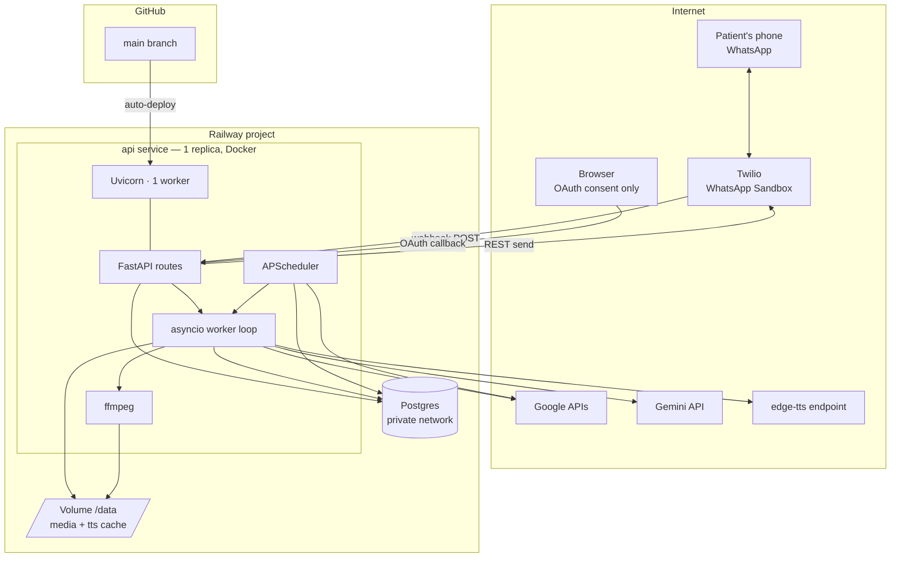

## 15.3 User authentication (OAuth)

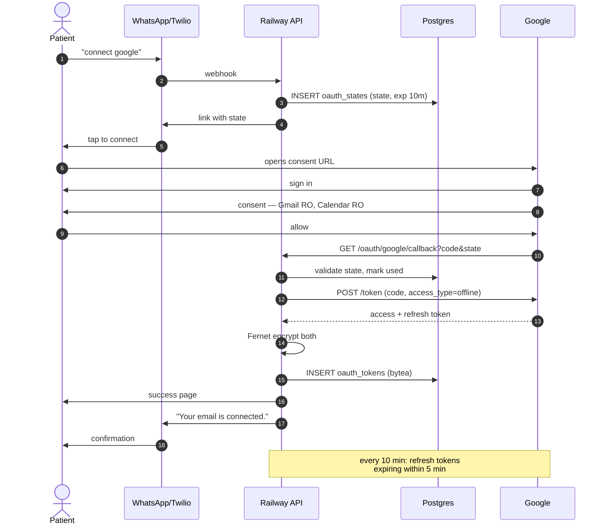

## 15.4 WhatsApp message flow

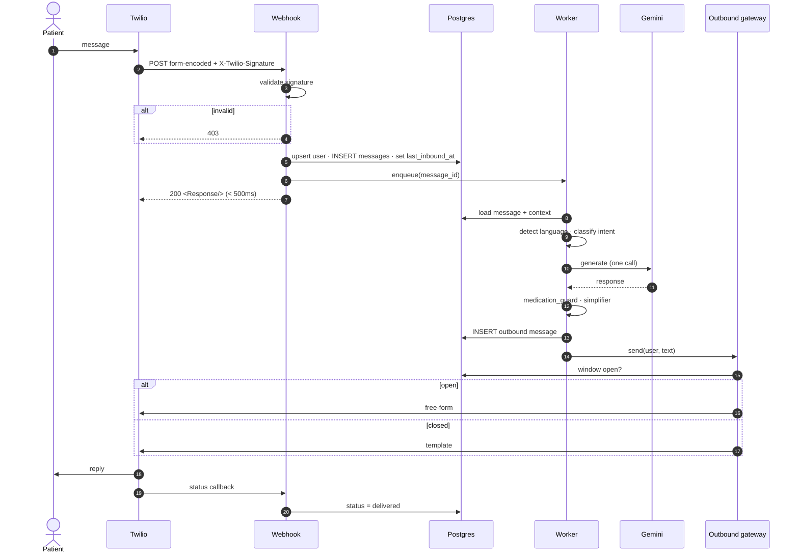

## 15.5 Voice processing

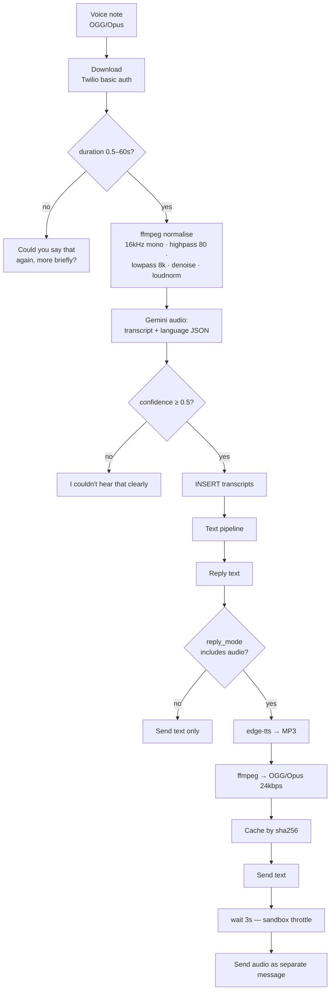

## 15.6 Image processing

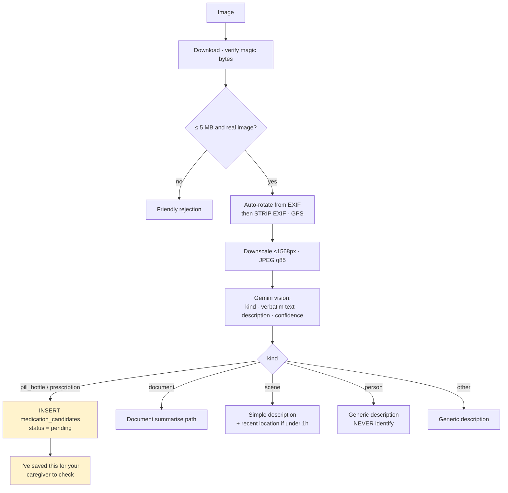

The highlighted path is the safety-critical one: vision output never reaches `medications`.

## 15.7 PDF processing

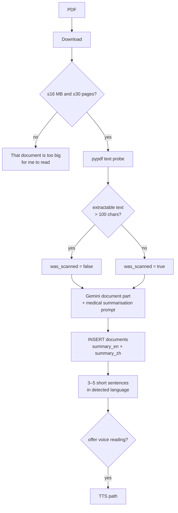

## 15.8 Gmail flow

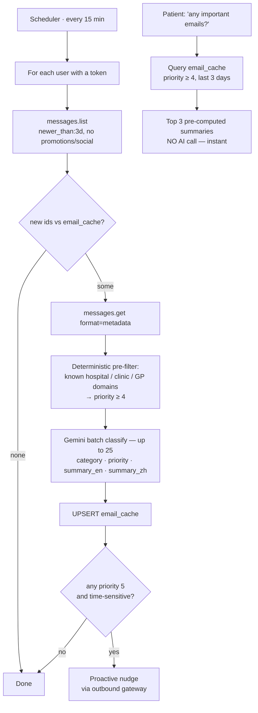

The rules-based pre-filter runs **before** the model so a model failure can never bury a
hospital email.

## 15.9 Calendar flow

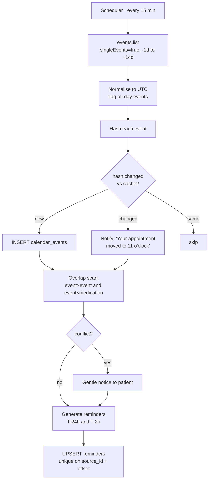

## 15.10 Reminder flow

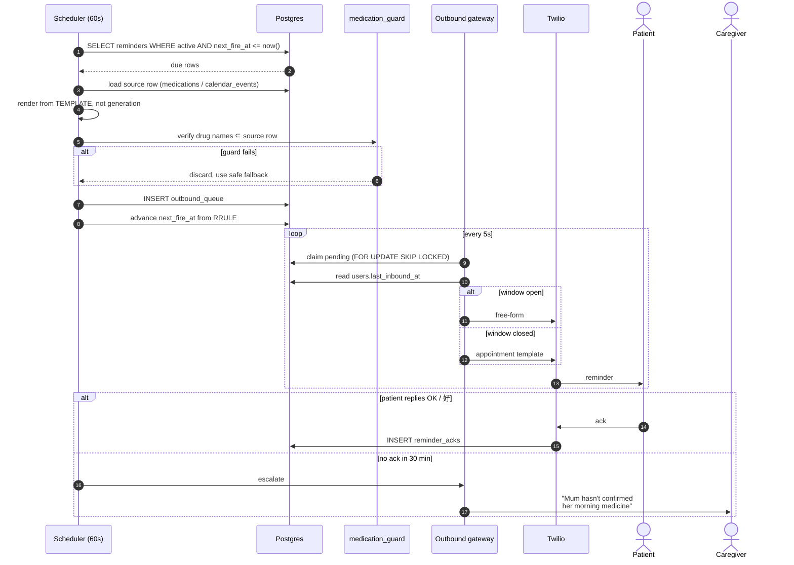

## 15.11 SOS flow

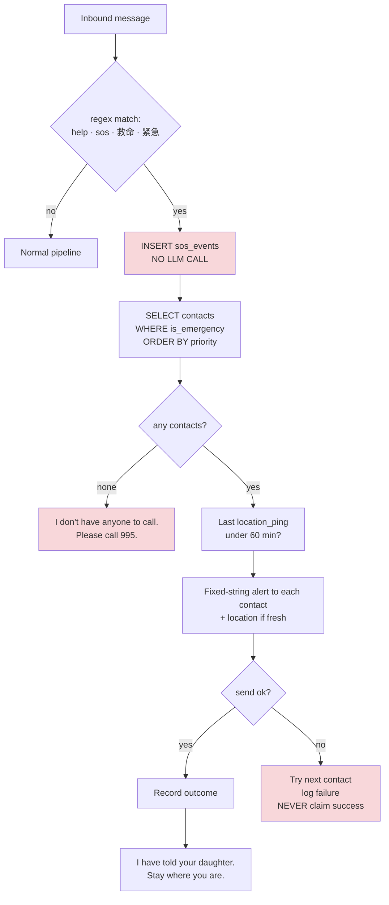

No LLM anywhere in this path. A Gemini outage must not break SOS.

## 15.12 Location & safe zones

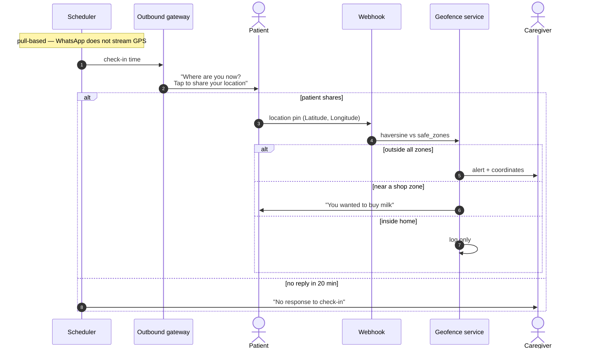

## 15.13 Database ER diagram

See `08-database.md` §8.1.

## 15.14 Message lifecycle state machine

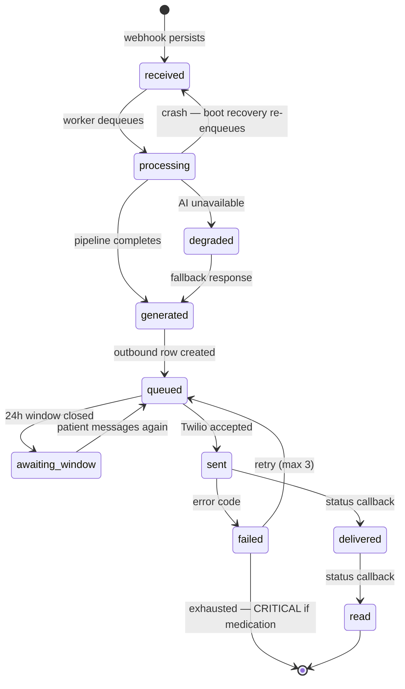

The `processing → received` edge is the boot recovery pass. It is why a crash mid-pipeline
costs a delay rather than a lost message.
